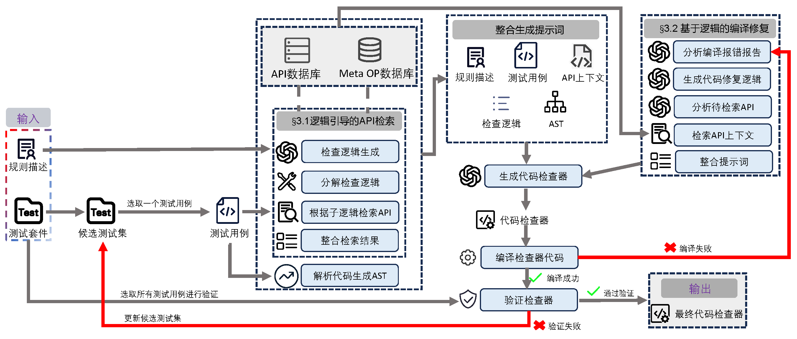

# AutoChecker
AutoChecker是一个静态代码检查器自动生成工具，以规则描述和测试套件作为输入，借助LLM的代码生成功能，生成指定的静态检查器代码，目前支持生成Clang-Tidy的checker代码（针对C/C++语言）、PMD的checker代码（针对JAVA语言）、Codeql的query代码（针对多语言）。

**Overview**:

# 软件部署流程
## 目录树
使用如下命令将软件克隆到本地：
```shell
git clone https://github.com/SQUARE-RG/AutoChecker.git
cd AutoChecker
```
进入项目根目录后，可以看到如下目录树：

+ AutoChecker ---------------------------------软件根目录
  + llvm-project ----------------------------llvm本地仓库
  + clang_tidy_collect --------收集meta-OP数据库和API数据库
    + check_op.json -------------check函数相关meta-OP数据库
    + astMatcher_op.json ------astMatcher相关meta-OP数据库
    + all_astMatchers.json --------astMatcher相关API数据库
    + all_check_api.json ----------check函数相关API数据库
  + test_case ------------------------------测试用例目录
    + test_case_1.cpp
    + ......
  + result-generation --------------------软件输出目录
    + first_checker ---------------第一阶段生成的检查器代码
      + checker.cpp
      + checker.h
    + final_checker ------------------最终生成的检查器代码
      + checker_final.cpp
      + checker_final.h
  + src
    + ......
    + main.py ----------------------软件入口
    + config.json ------------------软件配置文件
  + rule.json ---------------------------------软件输入
  + requirements.txt


软件运行需要依赖python环境并提前编译clang-tidy等工具，做好准备工作后，需要按照要求修改输入文件rule.json并提供相关测试用例套件。
## 环境准备
准备软件运行需要的python环境，并且提前编译clang-tidy，软件未来会支持生成Codeql的query文件，所以也需要提前准备Codeql的环境。
### python 环境准备
推荐使用Anaconda创建虚拟环境，请依次执行如下命令完成创建虚拟环境和依赖包一键安装。
```shell
# 创建虚拟环境
conda create -n autochecker python=3.10
conda activate autochecker 
# 进入软件根目录
cd AutoChecker
pip install -r requirements.txt
```
### 编译clang-tidy
需要提前编译Clang-Tidy，请依次执行如下命令完成编译过程：
```shell
sudo apt-get update
sudo apt-get install -y cmake ninja-build gcc g++ zlib1g-dev git libxml2 libedit-dev
sudo apt-get install -y openssh-server python3 libreadline-dev libgmp-dev pkg-config
sudo apt-get install -y libdebuginfod-dev python-is-python3 libexpat-dev libmpfr-dev
sudo apt-get install -y file source-highlight libsource-highlight-dev liblzma-dev

git clone https://github.com/llvm/llvm-project --recursive

cd llvm-project
git checkout release/17.0.x

mkdir build
cd build


cmake \
-G Ninja \
-DCMAKE_EXPORT_COMPILE_COMMANDS=ON \
-DCMAKE_BUILD_TYPE=RelWithDebInfo \
-DLLVM_USE_SPLIT_DWARF=ON \
-DLLVM_OPTIMIZED_TABLEGEN=ON \
-DLLVM_TARGETS_TO_BUILD=X86 \
-DLLVM_ENABLE_PROJECTS='clang;clang-tools-extra' \
-DBUILD_SHARED_LIBS=ON \
-DLLVM_ENABLE_BINDINGS=OFF \
-DCLANG_ENABLE_ARCMT=OFF \
-DLLVM_INCLUDE_TESTS=OFF \
-DCLANG_INCLUDE_TESTS=OFF \
-DCMAKE_C_COMPILER_LAUNCHER=ccache \
-DCMAKE_CXX_COMPILER_LAUNCHER=ccache \
-S ../llvm -B .


# 编译
cmake --build . --target FileCheck -j
cmake --build . --target clang-tidy clang clang-query -j56

```


### codeql 部署：
软件也支持codeql工具，可以按照如下命令安装codeql：
```shell
sudo apt update
sudo apt install build-essential libncurses-dev flex bison libssl-dev libelf-dev
# 下载codeql 
wget https://github.com/github/codeql-cli-binaries/releases/latest/download/codeql-linux64.zip
sudo unzip codeql-linux64.zip -d /opt/
sudo chmod -R 755 /opt/codeql

# 将 CodeQL 可执行文件路径添加到当前用户的 PATH 环境变量中
echo 'export PATH="$PATH:/opt/codeql/"' >> ~/.bashrc
source ~/.bashrc

# 验证安装
codeql version

# 获取codeSDK

git clone https://github.com/github/codeql.git /path/to/codeql-repo

```
软件生成的query可以直接扫描Linux内核，可以执行如下命令将Linux内核克隆到本地：
```shell
git clone https://github.com/torvalds/linux.git
```

建议先测试codeql在linux内核仓库中是否可以使用，请依次执行如下命令：

```shell
codeql database create ../linux-db/spi-pci1xxx-db --language=cpp --command="make drivers/spi/spi-pci1xxxx.o -j8" --source-root=.

cd /root/code_check/codeql/cpp/ql/src
mkdir MyQL
touch test.ql
## 编写ql

codeql database analyze ../linux-db/spi-pci1xxx-db/ --format=csv --output=../result.csv ../codeql/cpp/ql/src/MyQL/test.ql
```
可以编写一个简单的ql文件，例如：
```sql
/**
 * @id cpp/custom/find-devm-kzalloc-calls
 * @name 查找 devm_kzalloc 调用
 * @description 在驱动代码中查找所有对 devm_kzalloc 函数的调用位置。
 * @kind problem
 * @tags reliability
 * @precision high
 * @problem.severity warning
 */

import cpp
import DevmKzalloc // 导入你的自定义模块
from FunctionCall fc
where fc.getTarget().getName() = "devm_kzalloc"
select fc, "找到调用"
```

运行该ql后的执行结果：
```txt
"查找 devm_kzalloc 调用","在驱动代码中查找所有对 devm_kzalloc 函数的调用位置。","warning","找到对 devm_kzalloc 的调用","/drivers/spi/spi-pci1xxxx.c","818","12","818","23"
"查找 devm_kzalloc 调用","在驱动代码中查找所有对 devm_kzalloc 函数的调用位置。","warning","找到对 devm_kzalloc 的调用","/drivers/spi/spi-pci1xxxx.c","829","28","829","39"
```


## 输入与输出
AutoChecker的输入是规则的基本信息和相关的测试用例，输入是Clang-Tidy检查器代码。下面用一个示例说明
修改软件根目录的rule.json文件，填写相关信息，如下所示。
```json
{
    "data": {
        "ucassaat": [
            {
               "title": "clang-tidy - declare-anonymous-struct",
                "main_title": "declare-anonymous-struct",
                "description": "This rule prohibits the inclusion of anonymous structs (i.e., nested struct types without a variable name) within struct definitions. An anonymous struct refers to a type that is directly embedded inside an outer struct but lacks an explicit variable name identifier. If a nested struct is assigned a specific variable name, it complies with the rule. This rule applies to all levels of struct nesting, including multi-level scenarios, and covers direct members of structs regardless of their scope (global or local).",
                "category": "ucassaat",
                "rule_test_path": "declare_anonymous_struct"
            }
        ]
    }
}
```

在输入的rule.json文件中，main_title字段是必填的规则名称，title字段可选，description字段填写该规则描述，说明该规则的内容和适用范围。rule_test_path字段是测试用例套件的路径，推荐使用绝对路径，而category字段可选，通常标识这个规则的类型。

测试用例的要求是以cpp或者c结尾的代码文件，且每个代码文件必须可以独立编译，保证没有语法或者其他错误。

软件默认输出位置是根目录下的result-generation目录，这里保存着第一阶段生成的检查器代码和最终生成的检查器代码。Clang-Tidy的检查器代码包含一个后缀为h的头文件和一个后缀为cpp的代码文件。
## 运行软件
完成之前的准备工作后，需要根据实际情况调整配置文件，即软件根目录下的config.json，需要调整的字段及其说明如下表所示。


| 字段 | 说明 | 示例 |
| :--- | :--- | :--- |
| `embedding_model` | Embedding模型的路径 | `src/retriever/embedding_model/bge-large-en-v1.5` |
| `result_dir` | 软件输出路径 | `result-generation/` |
| `max_round` | 处理每个测试用例的迭代最大次数 | `2` |
| `max_compiler_trys` (或 `max_compiler_tries`) | 修复检查器编译失败的最大次数 | `2` |
| `top_key` | 检索前K个最相关的代码片段 | `2` |


使用命令python <AutoChekcer所在目录>/src/main.py  <rule.json路径> 运行软件，等待检查器代码生成。最终生成的结果会保存在默认的输出目录: <AutoChekcer所在目录>/result-generation/final_checker 。

生成的检查器在测试套件中的表现保存在checker_genration_result.json文件中，内容如下所示。
```json
{
    "data": {
        "ucassaat": [
            {
               "title": "clang-tidy - declare-anonymous-struct",
                "main_title": "declare-anonymous-struct",
                "description": "This rule prohibits the inclusion of anonymous structs (i.e., nested struct types without a variable name) within struct definitions. An anonymous struct refers to a type that is directly embedded inside an outer struct but lacks an explicit variable name identifier. If a nested struct is assigned a specific variable name, it complies with the rule. This rule applies to all levels of struct nesting, including multi-level scenarios, and covers direct members of structs regardless of their scope (global or local).",
                "category": "ucassaat",
                "rule_test_path": "declare_anonymous_struct",
                "negative_case_amount": 10,
                "positive_case_amount": 10,
                "issuccess": "True",
                "performance": "20/20",
                "success_case_list": [
                    "declare_anonymous_struct/declare_anonymous_struct_case_18.cpp",
                    "declare_anonymous_struct/declare_anonymous_struct_case_3.cpp",
                    "declare_anonymous_struct/declare_anonymous_struct_case_6.cpp",
                    "declare_anonymous_struct/declare_anonymous_struct_case_13.cpp",
                    "declare_anonymous_struct/declare_anonymous_struct_case_4.cpp",
                    "declare_anonymous_struct/declare_anonymous_struct_case_11.cpp",
                    "declare_anonymous_struct/declare_anonymous_struct_case_1.cpp",
                    "declare_anonymous_struct/declare_anonymous_struct_case_20.cpp",
                    "declare_anonymous_struct/declare_anonymous_struct_case_8.cpp",
                    "declare_anonymous_struct/declare_anonymous_struct_case_2.cpp",
                    "declare_anonymous_struct/declare_anonymous_struct_case_19.cpp",
                    "declare_anonymous_struct/declare_anonymous_struct_case_10.cpp",
                    "declare_anonymous_struct/declare_anonymous_struct_case_17.cpp",
                    "declare_anonymous_struct/declare_anonymous_struct_case_16.cpp",
                    "declare_anonymous_struct/declare_anonymous_struct_case_9.cpp",
                    "declare_anonymous_struct/declare_anonymous_struct_case_7.cpp",
                    "declare_anonymous_struct/declare_anonymous_struct_case_5.cpp",
                    "declare_anonymous_struct/declare_anonymous_struct_case_12.cpp",
                    "declare_anonymous_struct/declare_anonymous_struct_case_14.cpp",
                    "declare_anonymous_struct/declare_anonymous_struct_case_15.cpp"
                ],
                "failed_case_list": [],
                "total_cost": "0.049582",
                "negative_case_analysis": {
                    "check_success_negative": 10,
                    "check_failed_negative": 0
                },
                "time": "330.61"
            }
        ]
    }
}
```

从输出结果的performance字段来看，软件生成的代码检查器通过了所有的测试用例，准确率100%。total_cost字段显示了整个迭代过程使用LLM的api花费约0.04元人民币，成本低廉。time字段记录了整个生产过程花费330秒，时间花销也在合理范围内。

## 输出代码
输出除了上面的checker_genration_result.json，还有最终的检查器代码及所有中间结果。AutoChecker遇到检测失败的测试用例便优化编程规则检查器，每优化一次，便输出相关日志（包含检测失败的测试用例、优化前的编程规则检查器、优化后的编程规则检查器），直到某一个优化后的编程规则检查器检测通过全部测试用例，终止运行。输出的检查器代码内容示例如下所示。

```cpp
//===--- DeclareAnonymousStructCheck.cpp - clang-tidy ---------------------===//
//
// Part of the LLVM Project, under the Apache License v2.0 with LLVM Exceptions.
// See https://llvm.org/LICENSE.txt for license information.
// SPDX-License-Identifier: Apache-2.0 WITH LLVM-exception
//
//===----------------------------------------------------------------------===//

#include "DeclareAnonymousStructCheck.h"
#include "clang/AST/ASTContext.h"
#include "clang/ASTMatchers/ASTMatchFinder.h"
#include "clang/ASTMatchers/ASTMatchers.h"

using namespace clang::ast_matchers;

namespace clang::tidy::ucassaat {

void DeclareAnonymousStructCheck::registerMatchers(MatchFinder *Finder) {
  // Match struct/union/class definitions that contain fields with record type
  Finder->addMatcher(
      recordDecl(isDefinition(),
                 has(fieldDecl(hasType(recordType()))
                         .bind("field")))
          .bind("record"),
      this);
}

void DeclareAnonymousStructCheck::check(const MatchFinder::MatchResult &Result) {
  const auto *Record = Result.Nodes.getNodeAs<RecordDecl>("record");
  const auto *Field = Result.Nodes.getNodeAs<FieldDecl>("field");

  if (!Record || !Field || !Record->getLocation().isValid() ||
      !Field->getLocation().isValid())
    return;

  // Get the type of the field
  const Type *FieldType = Field->getType().getTypePtrOrNull();
  if (!FieldType)
    return;

  // Check if it's an elaborated type (e.g., 'struct X')
  if (const auto *Elaborated = dyn_cast<ElaboratedType>(FieldType)) {
    FieldType = Elaborated->getNamedType().getTypePtrOrNull();
    if (!FieldType)
      return;
  }

  // Get the record declaration from the field type
  const RecordType *RecordTy = dyn_cast<RecordType>(FieldType);
  if (!RecordTy)
    return;

  const RecordDecl *InnerRecord = RecordTy->getDecl();
  if (!InnerRecord || !InnerRecord->isAnonymousStructOrUnion())
    return;

  // Emit diagnostic
  diag(Field->getLocation(),
       "禁止结构体定义中含有匿名结构体 [gjb8114-r-1-1-9]")
      << Field->getSourceRange();

  // Add note pointing to the outer struct definition
  if (Record->getIdentifier()) {
    diag(Record->getLocation(), "外层结构体 '%0' 定义在此",
         DiagnosticIDs::Note)
        << Record->getName() << Record->getSourceRange();
  } else {
    diag(Record->getLocation(), "外层结构体定义在此", DiagnosticIDs::Note)
        << Record->getSourceRange();
  }
}

} // namespace clang::tidy::ucassaat
```