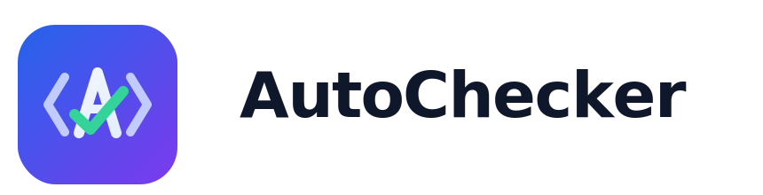
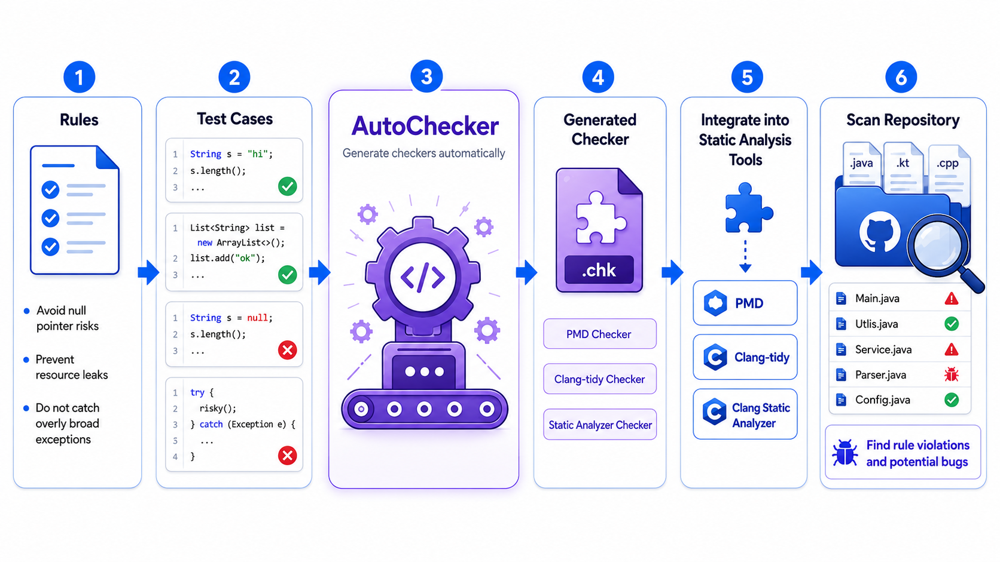

<p align="center">
  
</p>

<p align="center">
  <strong>Write Your Own Checker</strong>
</p>

<p align="center">
  An automated checker generation framework for mainstream static analysis tools
</p>

<p align="center">
  <a href="./README.md"></a>
  <a href="./README-cn.md"></a>
  <a href="https://github.com/SQUARE-RG/AutoChecker/blob/master/LICENSE"></a>
</p>

---

# AutoChecker

**AutoChecker is a tool that automatically generates code checkers for mainstream static analysis tools based on user-defined rule requirements.**

In day-to-day development, we often need to check whether code follows specific rules, such as whether there are null pointer risks, whether resources are released correctly, or whether naming conventions are followed. Although static analysis tools provide some built-in checkers, those built-in rules often do not fully cover real-world, customized requirements. Writing a new checker manually is both time-consuming and error-prone.

AutoChecker offers a new solution for this scenario: **users only need to provide a rule description and examples, and AutoChecker can automatically generate a usable checker for the target static analysis tool**. For the same rule, AutoChecker can also generate checkers for multiple analysis tools, allowing users to choose the one that best fits their workflow.



## Core Capabilities

- **Automatically generate checkers from rule descriptions and test cases**: users provide a rule description together with positive and negative test cases, and the tool outputs checker code that can be used directly in the target static analysis tool.
- **Write once, reuse across multiple tools**: the same rule specification and test cases can be reused for different analysis tools, reducing duplicated effort and improving portability.
- **Extensible to multiple static analysis tools**: the current documentation covers `PMD`, `clang-tidy`, and `CodeQL`, with support for more tools planned in the future.

## Online Demo

You can now try AutoChecker directly in the browser:

[AutoChecker.platform](https://autochecker.veilaxis.com/)

## Installation Guide

AutoChecker currently provides two installation methods:

- **Manual installation**: install dependencies, configure environment variables, and build manually. This mode can be used to generate checkers for `PMD`, `clang-tidy`, `CodeQL`, and more.
- **Docker deployment**: use Docker to complete environment setup and toolchain preparation in one step. This mode currently supports generating `clang-tidy` and `CodeQL` checkers.

### Manual Installation

#### Environment Requirements

| Item | Requirement |
| --- | --- |
| Disk Space | At least 64 GB |
| Memory | At least 16 GB |
| CPU | At least 4 cores |
| Operating System | Ubuntu 22.04 (recommended) |
| LLM API Key | An API key for a large language model is required, such as DeepSeek or OpenAI |

#### Step 1: Prepare the Environment

Clone the repository:

```bash
git clone https://github.com/SQUARE-RG/AutoChecker.git
```

Create a virtual environment and install dependencies:

```shell
# Create a virtual environment
conda create -n autochecker python=3.10
conda activate autochecker

# Enter the project root directory
cd AutoChecker
pip install -r requirements.txt
```

#### Step 2: Install Static Analysis Engines

Install the required static analysis engines according to your needs:

1. [Deploy PMD](/doc/pmd_install_cn.md)
2. [Deploy clang-tidy](/doc/clang_tidy_install_cn.md)
3. [Deploy CodeQL](/doc/codeql_deploy_cn.md)

#### Step 3: Configure the LLM

Create a `.env` file in the project root directory and fill in your LLM API information:

```env
API_KEY=your_api_key
MODEL=model_name (e.g. deepseek, gpt-4)
BASE_URL=api_endpoint (e.g. https://api.deepseek.com)
```

After the configuration is complete, you can move on to preparing rules and test cases.

#### Step 4: Prepare Rules and Test Suites

Create a `rule.json` file in the project root directory:

```json
{
    "data": {
        "ucassaat": [
            {
                "main_title": "use-uncheck-pointer-after-malloc",
                "description": "The rule requires that any pointer obtained through dynamic memory allocation functions (such as malloc, calloc, or realloc) must be checked for non-null before its first use. This check must occur before the pointer is used; performing the check after use is considered a violation. Acceptable check methods include explicit or implicit null pointer comparisons like if (ptr != NULL), if (ptr), or if (!ptr). If a dynamically allocated pointer is never used, it does not violate this rule. If a pointer is reallocated, it must be checked again before any subsequent use. This rule applies equally to global and local variables. Only one warning should be reported per violating pointer variable.",
                "rule_test_path": "/root/code_check/experiment/gjb8114/codeql_test_case/use_uncheck_pointer_after_malloc"
            }
        ]
    }
}
```

Notes:

- `rule_test_path` must be an absolute path pointing to the directory of the test suite.
- For violating test cases, use `CHECK-MESSAGES` comments in the code to mark the expected results.

#### Step 5: Run

```shell
python src/main.py --rule_file rule.json --language cpp --analyzer clang-tidy
```

The generated results are saved to the `result-generation` directory by default.

---

### Docker Deployment

#### Environment Requirements

| Dependency | Description |
| --- | --- |
| Docker | Version 28.1.1 or later is recommended |
| Operating System | Ubuntu 22.04 is recommended, though other Linux distributions should also work |
| LLM API Key | An API key for a large language model is required, such as DeepSeek or OpenAI |

#### Step 1: Clone the Project

```bash
git clone https://github.com/SQUARE-RG/AutoChecker.git
cd AutoChecker
```

#### Step 2: Build the Docker Image

The build process automatically installs the Python runtime, configures the `conda` virtual environment, downloads embedding models, and builds the related static analysis toolchains. The entire process typically takes around 10 minutes.

```bash
docker build -t autochecker:1.0 .
```

> The build process includes dependency installation and compilation, so please wait patiently. When you see `Successfully tagged autochecker:1.0`, the build has completed successfully.

#### Step 3: Create and Start the Container

```bash
docker run -it --name autochecker-container autochecker:1.0 /bin/bash
```

After execution, you will enter the container's interactive shell, with the default working directory set to the AutoChecker root directory.

#### Step 4: Configure the LLM

Inside the container, create a `.env` file in the project root directory and fill in your LLM API information:

```env
API_KEY=your_api_key
MODEL=model_name (e.g. deepseek, gpt-4)
BASE_URL=api_endpoint (e.g. https://api.deepseek.com)
```

After the configuration is complete, you can move on to preparing rules and test cases.

#### Step 5: Prepare the Rule File

Create a `rule.json` file in the project root directory and fill in your rule definition and test case path:

```json
{
    "main_title": "your_rule_name",
    "title": "short_rule_summary (optional)",
    "description": "Describe in detail what this rule is intended to detect and in what scenarios it applies.",
    "rule_test_path": "/absolute/path/to/test/case/directory/",
    "category": "rule_category (optional)"
}
```

Test case requirements:

- Use the file extension corresponding to the target language, such as `.cpp`, `.c`, or `.java`.
- Each test file should be independently compilable.

#### Step 6: Start Generation

```bash
python src/main.py --rule_file rule.json --language cpp --analyzer clang-tidy
```

The program prints progress information during execution. After generation finishes, the results are saved to the `result-generation/` directory by default, including:

- `final_checker/`: the final generated checker code, such as header and implementation files.
- `checker_generation_result.json`: the performance report of the checker on the test suite, including metrics such as accuracy, time cost, and usage cost.

#### Step 7: Integrate the Generated Checker

The generated checker code can be placed directly into the checker directory of the target static analysis tool and used after recompilation.

## Currently Supported Static Analysis Tools

| Tool | Supported Languages |
| --- | --- |
| PMD | Java |
| Clang-tidy | C/C++ |
| CodeQL | Multiple languages |

Planned support:

- Semgrep
- Clang Static Analyzer

## Configuration

The `config.json` file in the project root directory can be adjusted as needed:

| Parameter | Description | Default Value |
| --- | --- | --- |
| `max_round` | Maximum number of iteration rounds for each test case | 2 |
| `max_compiler_trys` | Maximum number of attempts to fix compilation failures | 5 |
| `top_key` | Number of most relevant code snippets retrieved | 2 |
| `result_dir` | Output directory for generated results | result-generation/ |

## Citation

If you use our work in your research or project, please consider citing:

1. Jun Liu*, Yuanyuan Xie*, Jiwei Yan#, Jinhao Huang, Jun Yan, Jian Zhang. Write Your Own CodeChecker: An Automated Test-Driven Checker Development Approach with LLMs. ICSE 2026. [paper](https://conf.researchr.org/details/icse-2026/icse-2026-research-track/43/Write-Your-Own-Code-Checker-An-Automated-Test-Driven-Checker-Development-Approach-wi)

```bibtex
@inproceedings{AutoChecker,
      title={Write Your Own CodeChecker: An Automated Test-Driven Checker Development Approach with LLMs},
      author={Jun Liu and Yuanyuan Xie and Jiwei Yan and Jinhao Huang and Jun Yan and Jian Zhang},
      booktitle={Proceedings of the International Conference on Software Engineering (ICSE)},
      year={2026}
}
```

## Maintainers and Contributors

AutoChecker is actively developed and maintained by members of [SQUARE Research Group](https://square16.org/):

- Jun Liu
- Yuanyuan Xie
- [Liqiang Ji](https://carlson-jlq.github.io/liqiang-ji.github.io/) ([@carlson-jlq](https://github.com/Carlson-JLQ))
- Jinhao Huang ([@jinhao-huang](https://github.com/jinhao-huang))
- Yuyang Xie ([@sisifuCha](https://github.com/sisifuCha))
- Xianglong Qi ([@Meiosis-Poor](https://github.com/Meiosis-Poor))
- [Jiwei Yan](https://hanada31.github.io/)

## Contributing

AutoChecker is an open source project, and contributions from the community are welcome.
For more details, please refer to the [Developer Guide](/doc/Developer_Guide.md).

## Star History

[](https://star-history.com/#SQUARE-RG/AutoChecker&Date)
